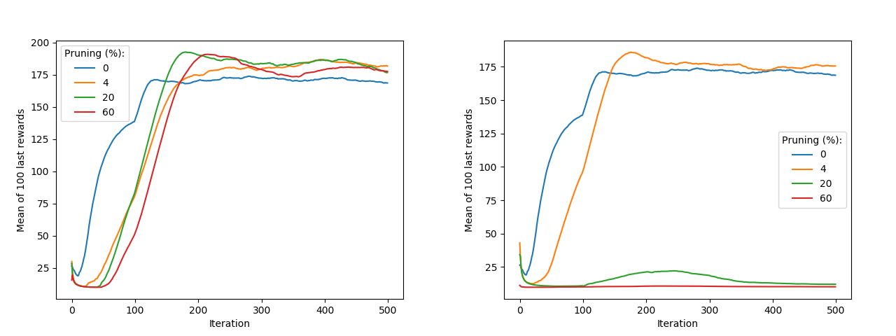

# Lottery Ticket Phenomena in Supervised and Reinforcement Learning

Two PyTorch experiments showing the [Lottery Ticket Phenomena](https://arxiv.org/abs/1803.03635) in two different contexts:

- Supervised Learning with the MNIST dataset and a FC network
- Reinforcement Learning with the Cartpole environment and a FC network

Here is a plot of the average of 10 experiments in the context of reinforcement learning. Left are the pruned weights reinitialized with the same values than the unpruned weights before training. Right are the pruned randomly reinitialized. We clearly see that pruning and keeping the initialization values make the agent closer from the solution while random reinitialization prevent the agent to converge to the solution.  

